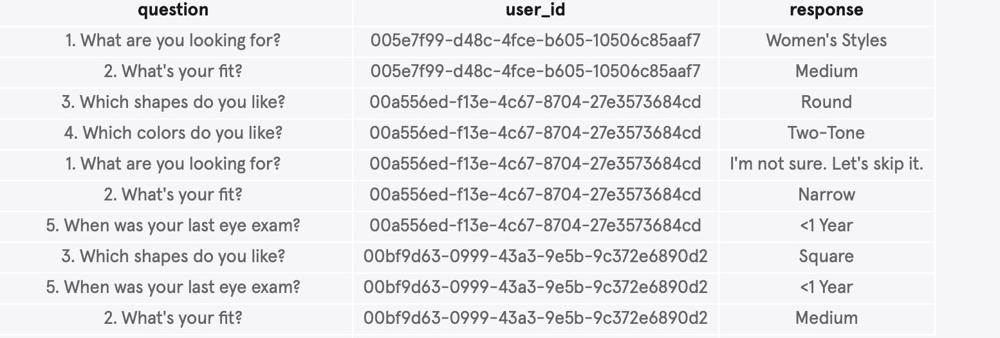

# Warby Parker Analysis

## Overview

This project utilizes a customer dataset to analyze the factors that result in higher purchases and makes recommendations on glasses to sell.

## Business Problem

The purpose of this project is to recommend improvements for Warby Parker's glasses survey, as well as identify the most commonly purchased glasses. This project identifies the questions with the biggest drop-off, and determines the strongest indicators of a successful sale. 

## Data Understanding

This project uses two marketing funnels and their tables. The first funnel lists the survey questions that each customer responded to and their responses. . The other funnel is a collection of data pertaining to different models of glasses sent to customers for a home try-on, split into three tables: 
* Quiz (resulting pair of glasses based on survey answers)
* Home_Try_On (number of pairs and customer addresses)
* Purchase (style, model, color, and price of purchased glasses)


## Methods

This project uses descriptive analysis, grouping data by user, aggregating purchases, and joining various tables. This provides key actionable insights for Warby Parker to improve their customer funnel and purchase rates.


## Conclusions

* 1. Question #3, “Which shape do you like?”, and question #5, “When was your last eye exam?”, were the two questions to cause the biggest drop-off, with 80% and 74.79% of participants, respectively, remaining after each question.
* 2. Customers given 5 pairs purchased glasses at a rate 26 points higher than customers given 3 pairs. It is clear that customers given more pairs to try on feel more comfortable with making a final purchase.
* 3. Men’s Dawes were the most purchased pair of glasses, just one more than second place. Women’s Eugene Narrow came in second and third, separated by different colors. Combined, they would take #1 by a significant amount. 


## Next Steps

* 1. Questions #3 and #5 should be revised, avoiding personal preference questions, as well as questions that cause people to have to respond with personal information that they may not remember.
* 2. Customers should be given the higher number of pairs for the home try-on portion of the process, as this results in significantly higher purchase rates. 
* 3. Given the abundance of Women's Eugene Narrow glasses in the top 5 purchased models, look into further promoting these models.

## For More Information

Review the data calculations in the [Excel Spreadsheet](./data_analysis.pdf) or review this [presentation](./presentation.pdf).

Author: Christopher Miley

May 2, 2025

## Repository Structure

```
├── images
├── README.md
├── data_analysis.pdf
└── presentation.pdf
```